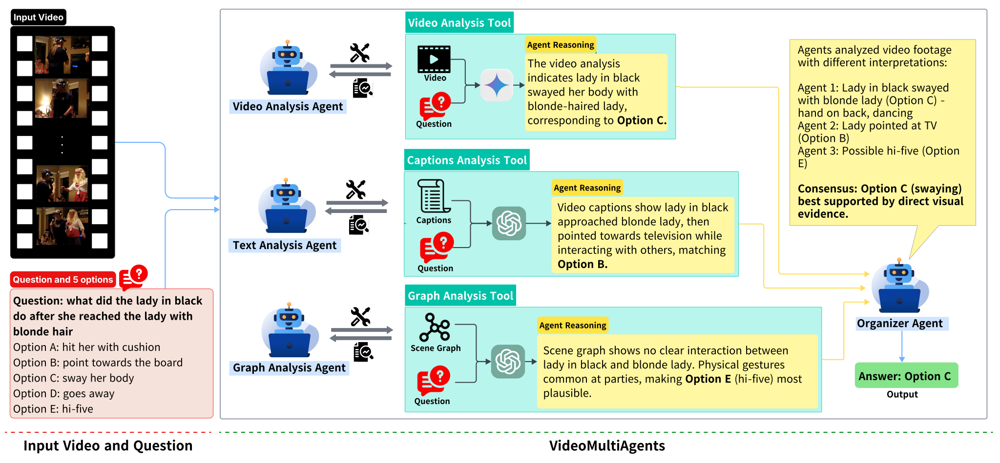
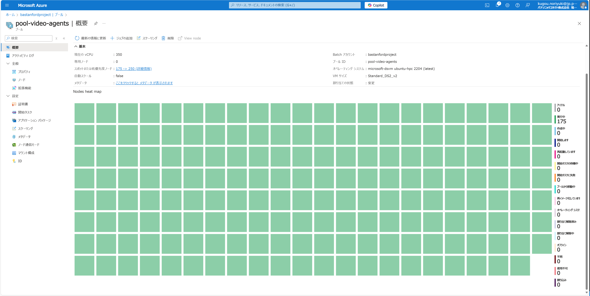

# VideoMultiAgents

## 🧠VideoMultiAgents: A Multi-Agent Framework for Video Question Answering

This is the official implementation of **VideoMultiAgents**, a multi-agent framework for video question answering (VQA). It uses specialized agents for visual, textual, and graph-based reasoning, coordinated by an Organizer Agent. By incorporating question-guided captions and scene graphs, the system enhances multimodal reasoning and supports understanding of long-form videos.

**Our method achieves state-of-the-art zero-shot performance on three benchmark datasets:**
- **79.0% on Intent-QA (+6.2% over SOTA)**
- **75.4% on EgoSchema subset (+3.4% over SOTA)**
- **79.6% on NExT-QA (+0.4% over SOTA)**

[Paper Link](https://xxxxxxxxxxxxxxxxxxxxxxxx)

## 🔖Prerequisites

- Docker installed

## 📚Dataset Preparation

- ### Step1 : Download the Datasets

    - #### EgoSchemaVQA dataset

        Please refer to the following official repository to download the EgoSchemaVQA dataset.

        https://github.com/egoschema/EgoSchema

    - #### NextQA dataset

        Raw videos for train/val/test are available at: (https://drive.google.com/file/d/1jTcRCrVHS66ckOUfWRb-rXdzJ52XAWQH/view).

        you may need map_vid_vidorID.json to find the videos, avaialble at: https://drive.google.com/file/d/1NFAOQYZ-D0LOpcny8fm0fSzLvN0tNR2A/view?usp=sharing

    - #### IntentQA Dataset
 
        This is the official repository for IntentQA  - https://github.com/JoseponLee/IntentQA
        Please download the original videos from here : https://drive.google.com/drive/folders/1xZG5bt5bEL8L1s29CmeRQPwM3Xx17n8o

    - #### HourVideo Demo Dataset
       Please refer the official repository of Hour Video- https://github.com/keshik6/HourVideo

- ### Step2 : Captions, Annotation and Summary Data

    Our model uses the question guided gpt 4o caption data. You can download the caption data, QA data and summary data from the following release link-

    https://github.com/PanasonicConnect/VideoMultiAgents/releases/tag/for_file_share

Then use the extract_images_features.py to convert Video files for NextQA dataset into frames and csv2json.py to convert val.csv to nextqa.json

## 🐋Container and Parameters Setting

- ### Step1 : set the environment variables

    Our model uses the OpenAI and Google Gemini APIs. So, Please set the proper api-key into the .env file

- ### Step2 : set the variables

    Set the appropriate file paths inside main.py

- ### Step3 : Build the container

    `docker compose build`

## 🚀Execute the script

- ### Step1 : Execute and Init the container

    - Execute the container

        `docker compose run video_multi_agent_env /bin/bash`

    - Init the container

        `docker exec -it <container_name> /bin/bash`

- ### Step2 : Run the script

    - EgoSchema Dataset

        `python3 main.py --dataset=egoschema --modality=modality --agents=agents`

    - Next-QA Dataset

        `python3 main.py --dataset=nextqa --modality=modality --agents=agents`

    - IntentQA Dataset (WIP)

        `python3 main.py --dataset=intentqa --modality=modality --agents=agents`

### Appendix
-   Run with multiple containers

    By adding the scale option, as shown in the following command, you can speed up its inference process.

    `docker compose up --scale video_multi_agent_env=10`

-  Run with Azure Batch

    Using Azure Batch, you can run the VideoMultiAgent more speedily by scaling up the number of nodes.

    Please refer to the following [Readme.md](./azure-batch/README.md)

    
